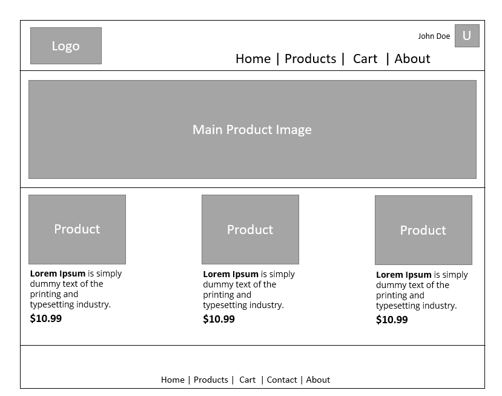
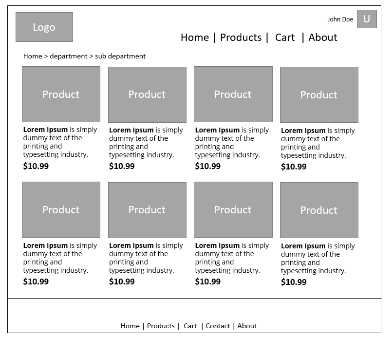
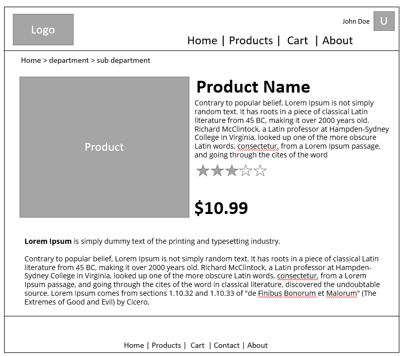
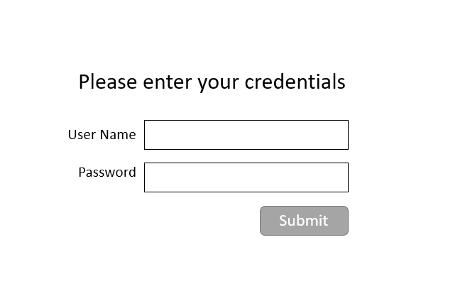
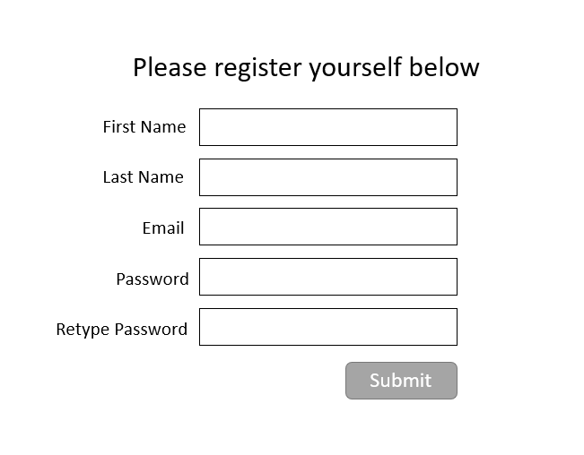

# Music Store Project 

## Project Overview 

My project is a music store where users can come to purchase their most beloved audio tracks or album. To purchase albums or individual tracks users will need to create an account and login because all product on the store are .mp3 files which the user can download anytime to their computers or phones. 

Upon purchase the system will send to the user an email with a verified unique link they can use for 3 days to download their purchased track or album. All downloads will be offered on a compressed .zip file for convience. 

Users can comeback to the website login and under the account section they will be able to find all previously purchased items and download them again. 

## Project Features 

- Home Page : A main product is featured and few new product shown 
- Catalog Page : Shows all albums and tracks available on the website user can search them 
- Album Page : All information about the Album and the tracks that are part of this album
- Track Page : All information about the Track itself 
- Login Page : Self explanatory :D
- Registration Page : Self explanatory 
- Shopping Cart Page : (Protected page) standard shopping cart with pay button that start the payment workflow 
- Help Page : How to use this website 
- Contact Us Page : All information about how to contact us and leave feedback 
- User Account Page : (Protected page) All user information + All previously purchased item available for download + delete this account (GDPR)

## Screen Mocks 

**Home Page**

   

**Catalog Page**

   

**Product Page**

   

**Login Page**

   

**Registration Page**

